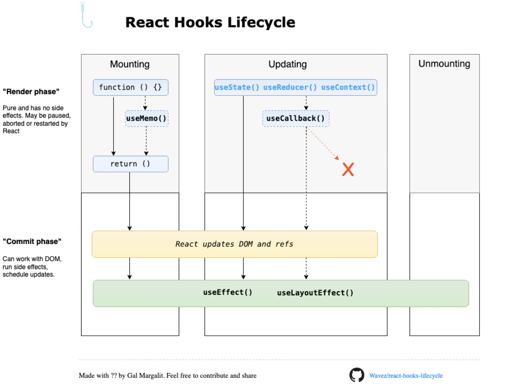
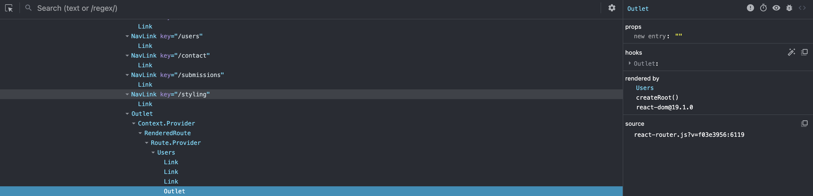
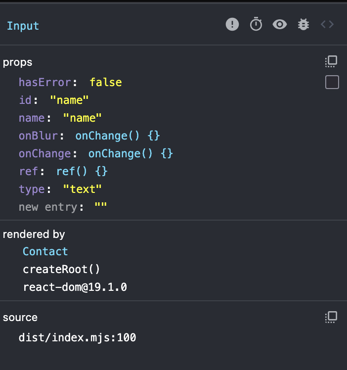

<!-- _class: title-slide -->

# React Training - Day 1 - Part II

## Performance and Optimization

---

# About Me


- **Productboard** (since March 2025)

  - Product Staff Engineer
  - Tech Lead Nucleus Guild, member of FE guild

- **React Experience**
  - React Lover (10+ years)
  - Consultant
  - Courses & Workshops
    - React, Next.js, QA
  - Video courses for Skillmea

---

# Agenda

1. Component's Lifecycle
2. React Profiler - DevTools
3. React Profiler API
4. Manual Memoization
5. Code Splitting & Lazy Loading
6. Background work - useTransition, useDeferredValue

---

# Component's Lifecycle



---

# React Profiler - DevTools



- Record and analyze component renders
- Identify performance bottlenecks
- Measure render times
- Track component updates

---

## React DevTools - Components Tab



- Inspect component tree
- View props and state
- Monitor re-renders
- Debug component hierarchy

---

## React DevTools - Profiler Tab

- Record performance profiles
- Analyze render durations
- Identify slow components
- Track component updates

---

# DevTools Demo

---

## React Profiler API

```typescript
// Profiler usage in component
<Profiler
  id="UserList"
  onRender={(
    id,          // ID of the component being profiled
    phase,       // "mount" | "update" | "nested-update"
    actualDuration, // Time spent rendering (ms)
    baseDuration,   // Estimated time without memoization (ms)
    startTime,      // When rendering started
    commitTime      // When rendering completed
  ) => {
    console.log({
      id,
      phase,
      actualDuration,
      baseDuration,
      startTime,
      commitTime
    });
  }}
>
  <UserList users={users} />
</Profiler>
```

---

## Profiler Parameters

| Parameter        | Description                                                                                                       |
| ---------------- | ----------------------------------------------------------------------------------------------------------------- |
| `id`             | Identifier of the profiled component                                                                              |
| `phase`          | Render phase:<br>- `mount`: Initial render<br>- `update`: Re-render<br>- `nested-update`: Nested component update |
| `actualDuration` | Actual time spent rendering in ms<br>(including memoization)                                                      |
| `baseDuration`   | Estimated time without memoization in ms<br>(helps identify memoization benefits)                                 |
| `startTime`      | Timestamp when rendering started                                                                                  |
| `commitTime`     | Timestamp when rendering completed                                                                                |

---

# Manual Memoization

---

## React.memo

> "React.memo is a higher order component that lets you skip re-rendering a component when its props are unchanged."

---

```typescript
// UserList.tsx
export const UserList: FC<{
  users: User[];
  onUserSelect: (userId: string) => void;
}> = memo(({ users, onUserSelect }) => {
  console.log('UserList render');

  return (
    <ul className="space-y-2">
      {users.map(user => (
        <UserItem key={user.id} user={user} onSelect={onUserSelect} />
      ))}
    </ul>
  );
});
```

---

```typescript
// UserItem.tsx
const UserItem: FC<{ user: User; onSelect: (id: string) => void }> = memo(({ user, onSelect }) => {
  console.log(`UserItem ${user.id} render`);

  return (
    <li onClick={() => onSelect(user.id)}>
      ...
    </li>
  );
};
```

---

## useMemo & useCallback

> "useMemo caches calculation results, useCallback caches function definitions between re-renders."

---

```typescript
// App.tsx
const App = () => {
  const [users] = useState<User[]>(MOCK_USERS);
  const [search, setSearch] = useState('');
  const [selectedUserId, setSelectedUserId] = useState<string | null>(null);

  // Memoize filtered users
  const filteredUsers = useMemo(() => {
    console.log('Filtering users...');
    return users.filter(user =>
      user.name.toLowerCase().includes(search.toLowerCase())
    );
  }, [users, search]);

  // Memoize user selection handler
  const handleUserSelect = useCallback((userId: string) => {
    setSelectedUserId(userId);
  }, []); // No dependencies needed

  ...
  return (
    <div>
      <SearchInput value={search} onChange={setSearch} />
      <UserList
        users={filteredUsers}
        onUserSelect={handleUserSelect}
      />
      <UserStats users={users} selectedUserId={selectedUserId} />
    </div>
  );
};
```

---

## When to Use Memoization

---

### React.memo

- Pure components with same props
- Components that re-render often
- Components with expensive renders
- List items in large lists

---

### useMemo

- Expensive calculations (filtering, sorting)
- Creating new objects/arrays
- Preventing unnecessary re-renders
- Derived state calculations

---

### useCallback

- Event handlers passed as props
- Functions used in dependency arrays
- Callbacks in optimized components
- List item click handlers

---

# Profiling Demo

## Data-way App (memoized, unmemoized)

---

# Concurrent React

## [Video - Ariel Shulman - Conquering Concurrent React](https://youtu.be/LijC4OQO3Y8?feature=shared&t=1078)

---

# Code Splitting & Lazy Loading

---

## React.lazy & Suspense

### Split work

```typescript
// DeclarativeRoutes.tsx
const Users = lazy(() => import('./components/Users').then(module => ({ default: module.Users })));

export const DeclarativeRoutes = () => (
  <Routes>
    <Route path="users">
      <Route
        index
        element={
          <Suspense fallback={<UsersLoading />}>
            <Users />
          </Suspense>
        }
      />
    </Route>
  </Routes>
);
```

---

# Code Splitting & Lazy Loading Demo

## Declarative-way App (DeclarativeRouter)

## Data-way App (App)

---

# Background Work

---

## useTransition

> "useTransition is a React Hook that lets you update the state without blocking the UI."

---

### Why useTransition?

- Prevents UI from blocking during state updates
- Improves perceived performance
- Better user experience during heavy operations
- Maintains UI responsiveness
- Helps with concurrent rendering
- Great for form actions

---

### Basic Usage

```typescript
// SearchComponent.tsx
const SearchComponent = () => {
  const [isPending, startTransition] = useTransition();
  const [query, setQuery] = useState('');
  const [results, setResults] = useState<SearchResult[]>([]);

  const handleSearch = (event: ChangeEvent<HTMLInputElement>) => {
    // Urgent: Update input
    setQuery(event.target.value);

    // Non-urgent: Update results
    startTransition(() => {
      setResults(performExpensiveSearch(e.target.value));
    });
  };

  return (
    <div>
      <input
        value={query}
        onChange={handleSearch}
        className={isPending ? 'searching' : ''}
      />
      {isPending ? (
        <Spinner />
      ) : (
        <SearchResults results={results} />
      )}
    </div>
  );
};
```

---

## useDeferredValue

> "useDeferredValue is a React Hook that lets you defer updating a part of the UI."

---

### Why useDeferredValue?

- Defer updates to non-critical UI
- Maintain UI responsiveness
- Automatic value deferring
- Works with any value type
- No manual transition management needed

---

### Basic Usage

```typescript
// SearchResults.tsx
const SearchResults = ({ query }: { query: string }) => {
  // Defer the search results update
  const deferredQuery = useDeferredValue(query);

  // Memoize the search results
  const results = useMemo(() => {
    return performExpensiveSearch(deferredQuery);
  }, [deferredQuery]);

  return (
    <div>
      {query !== deferredQuery && <Spinner />}
      <ResultsList results={results} />
    </div>
  );
};
```

---

### With Suspense

```typescript
const SearchPage = () => {
  const [query, setQuery] = useState('');
  const deferredQuery = useDeferredValue(query);

  return (
    <div>
      <SearchInput value={query} onChange={setQuery} />
      <Suspense fallback={<Spinner />}>
        <SearchResults query={deferredQuery} />
      </Suspense>
    </div>
  );
};
```

---

## Comparison: useTransition vs useDeferredValue

| Feature     | useTransition            | useDeferredValue                   |
| ----------- | ------------------------ | ---------------------------------- |
| Control     | Manual (startTransition) | Automatic                          |
| Use Case    | State updates            | Any value                          |
| Granularity | Per update               | Per value                          |
| Integration | With state setters       | With any value (prefer primitives) |
| Best for    | Controlled updates       | Automatic deferring                |

---

## Characteristics

1. **useTransition**

   - Use for state updates that can be deferred
   - Group related state updates
   - Show loading states with isPending
   - Keep UI responsive during transitions

2. **useDeferredValue**
   - Use for values that can be stale
   - Combine with useMemo for expensive calculations
   - Show loading states when value is stale
   - Works well with Suspense
   - For third-party libs

---

### When to Use Which?

- **useTransition**: When you need control over when the transition starts, and have access to the state updating
- **useDeferredValue**: When you want automatic deferring of value updates, and do not have access to the state updating
- **Both**: Can be used together for complex scenarios but mostly not needed!

---

## More & Caveats

- [useTransition](https://react.dev/reference/react/useTransition)
- [useDeferredValue](https://react.dev/reference/react/useDeferredValue)

---

# Background Work Demo

## Declarative-way App (UserStats, SearchableUserList)

---

# Resources

- [React Documentation](https://react.dev)

---

<!-- _class: title-slide -->

# Thank You!

## Questions?

### [kristofmartin.eu](https://www.kristofmartin.eu/)
